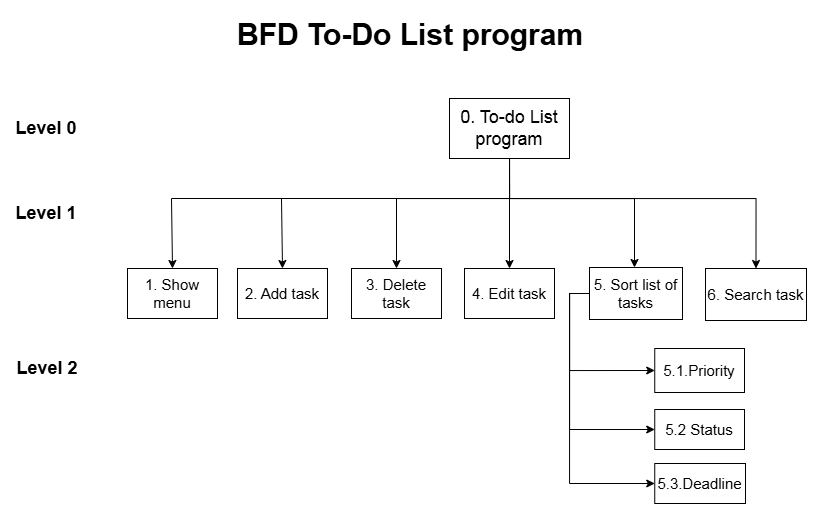

# **TO-DO LIST SUB_PROJECT**
## **1. Overview** 
Short description: This is a simple console-based application written in C that allows users to create to-do list to manage their daily tasks.  
Goal: Manage daily tasks by using to-do list.  
Objective: Improve C programming skill with static arrays & handling users input and output. Enhance console user interface skills.

## **2. Features**  
This program include serveral functions:  
+ Creating task.
+ Editing task.  
+ Deleting task.  
+ Searching task.
+ Viewing every tasks by completion progress.  



## **3. Getting Started**
### **3.1. Prerequisites**
Assuming you don't have any tools, then you will need:  
+ Ubuntu  
+ Git  
+ make  
+ MinGW-w64
### **3.2. Quick Start**
Step 1: Clone this repository to your computer by using:  
 ```git clone https://github.com/MinhDatj/Todo-List-sub_Program.git```   
Step 2: If cloned succesfully, you will see a directory named "Todo-List-sub_Program", go to that directory by using:  
```cd Todo-List-sub_Program/```  
Step 3: Grant execute permission to all .sh files so you can run them:  
```chmod +x utils/*.sh```   
Step 4: To get the executable file, use:  
```./utils/build.sh```  
If succeed, you will see a directory named `build` that contains a `main` file  
Step 5: To run the program, use:  
```./utils/run.sh```  
Bonus: When you need to delete build directory that was created during process, use:  
```./utils/clean.sh```   
